This documents how AI Cloud help the life-cycle of AI development.

# 0. port forwarding to open web on Mac
```
# ssh keyless to vpn,  take reference to http://www.linuxproblem.org/art_9.html
# install tool autossh, something like brew install autossh
autossh -M 20086 -f -nNT  -L 8001:127.0.0.1:8001 -L 5000:127.0.0.1:5000  -L 8080:127.0.0.1:30080  -L 8888:127.0.0.1:30088 -L 6006:127.0.0.1:30060 ai@1.tcp.ap.ngrok.io -p20100
# now open localhost:5000
``` 

# 1. show all resource in kubernetes
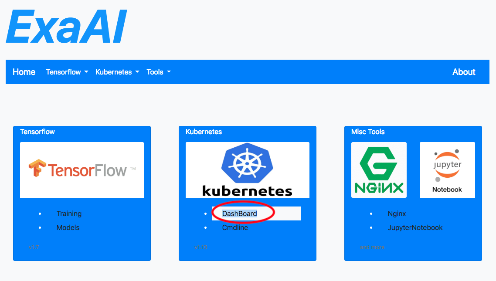
```
copy token, and open the dahboard button in new window
select token login, and paste the token
```
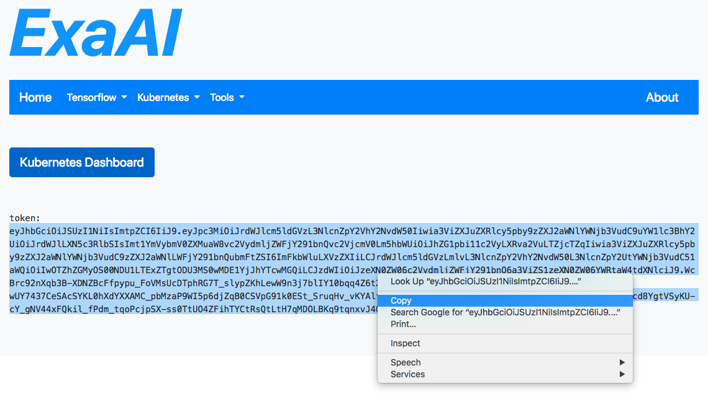

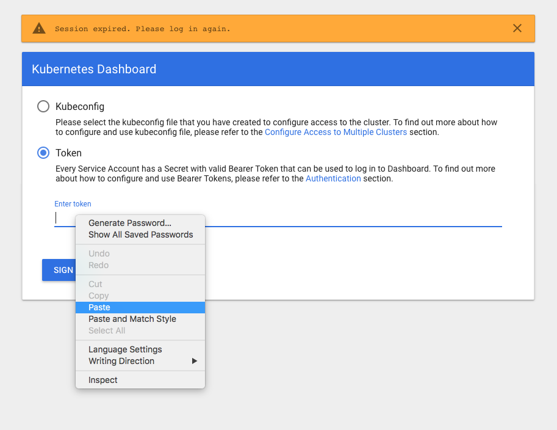

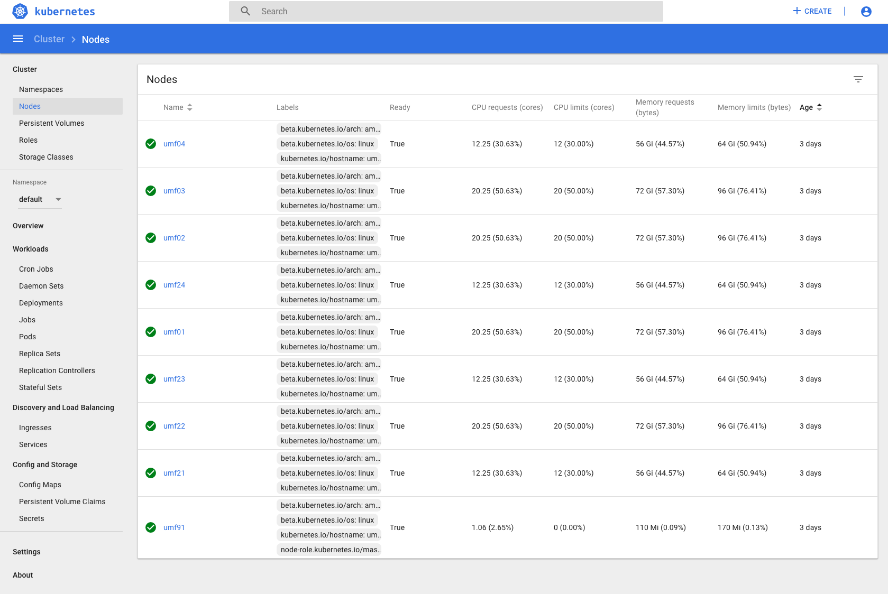

# 2. train a model 

[image](images/home_train.png)

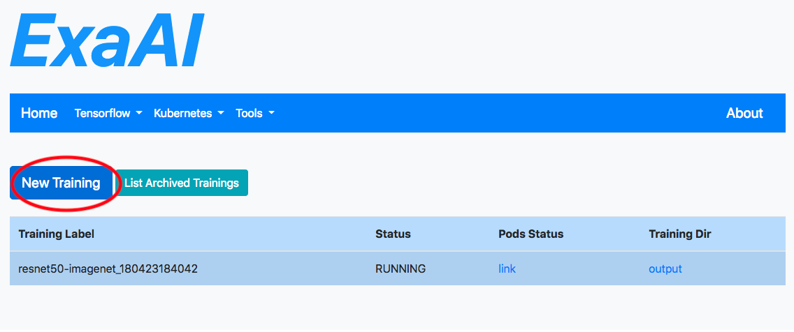

```
NUM_GPU set to 4, as we have max 4 GPU.
NUM_CPU set to 2, as larger number do no help performance, but only add initialize burden
NUM_EPOCH is float. try it youself. My estimate is do 0.01 for demo, whcih takes about 5 min. if you need overight training, set it to some big number like 9999, and kill stop it tomorrow. 
Do NOT train two concurrently. Always stop first before train second. 
During demo, repeatly click log for any worker, until you see completion.
```
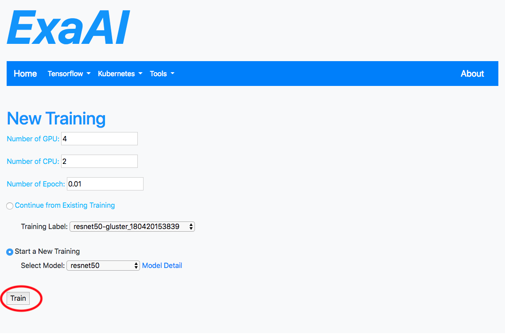

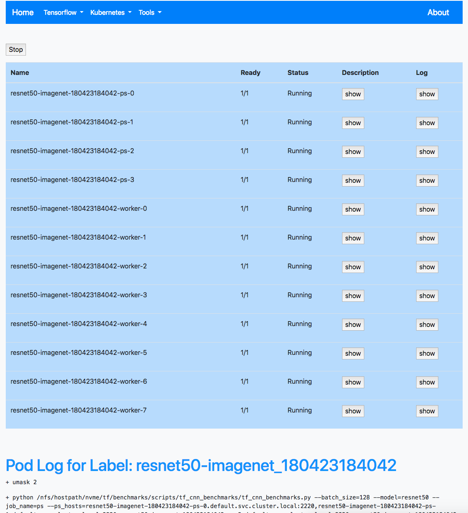

# 4. Load tensorboard
```
pick one that works, and click load
right click tensorboard button,, this may takes 1 min for US side at least.
Note synthetic data do not have much visualization details.
```
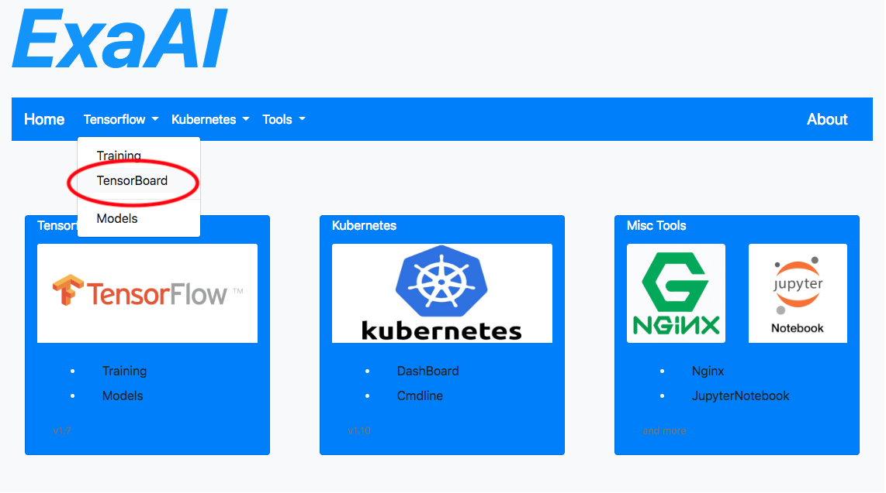

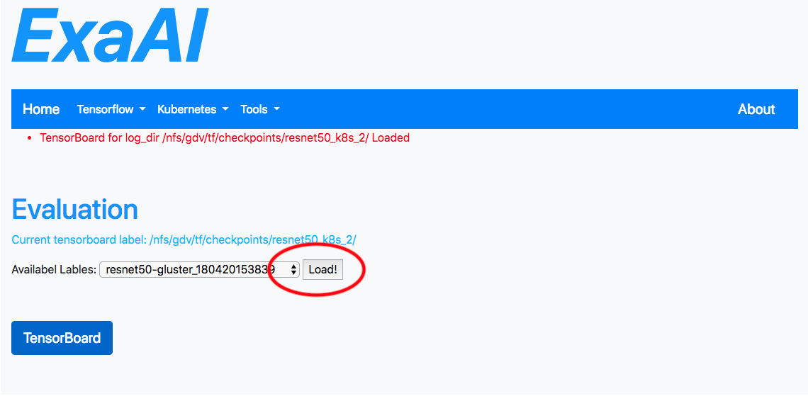

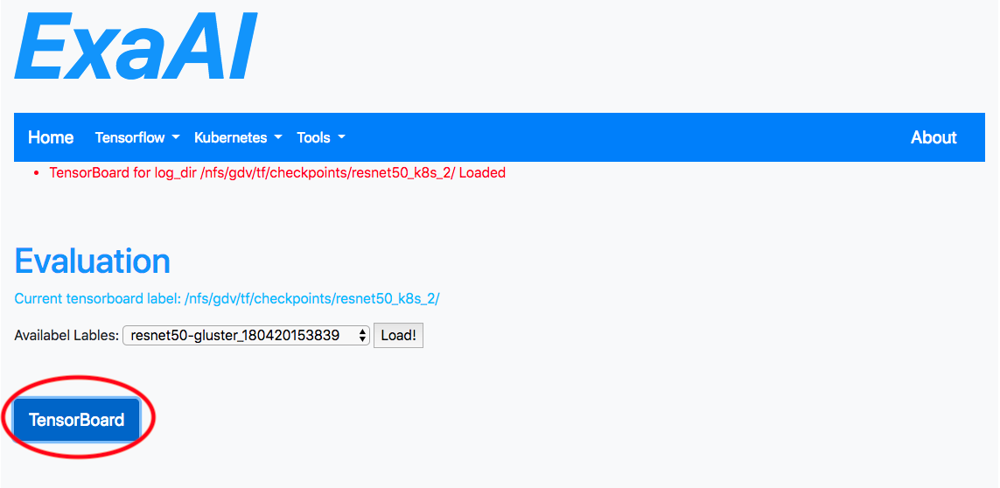

# 5. (Optional) Nginx and Jupyter
`check user guide if you want to demo these two`
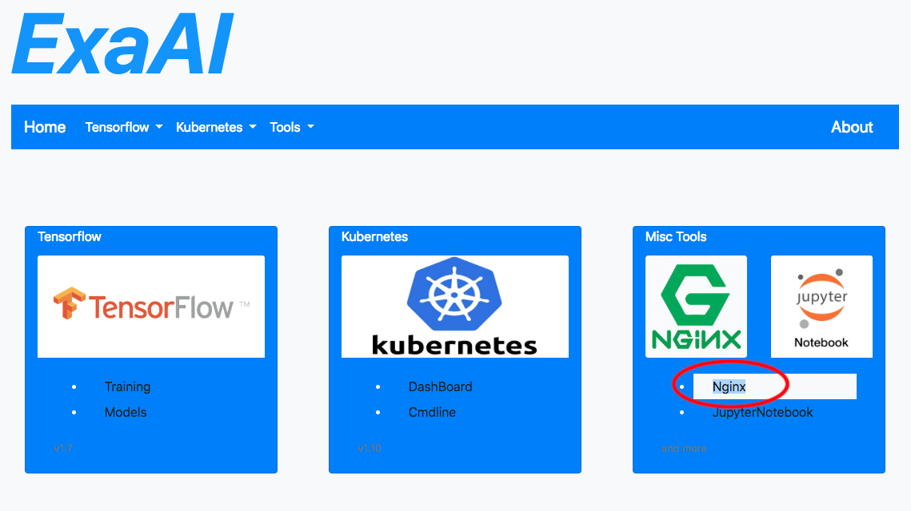
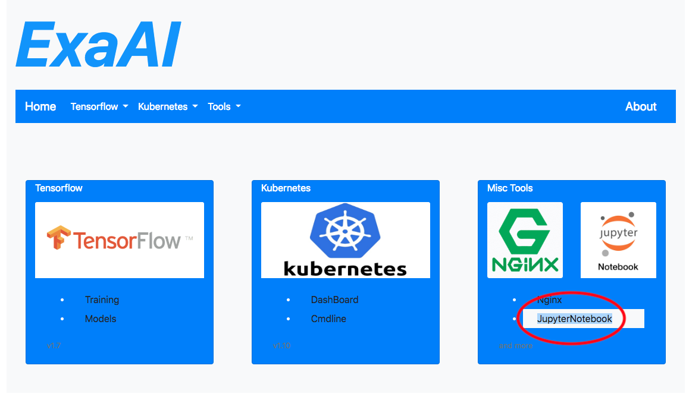
