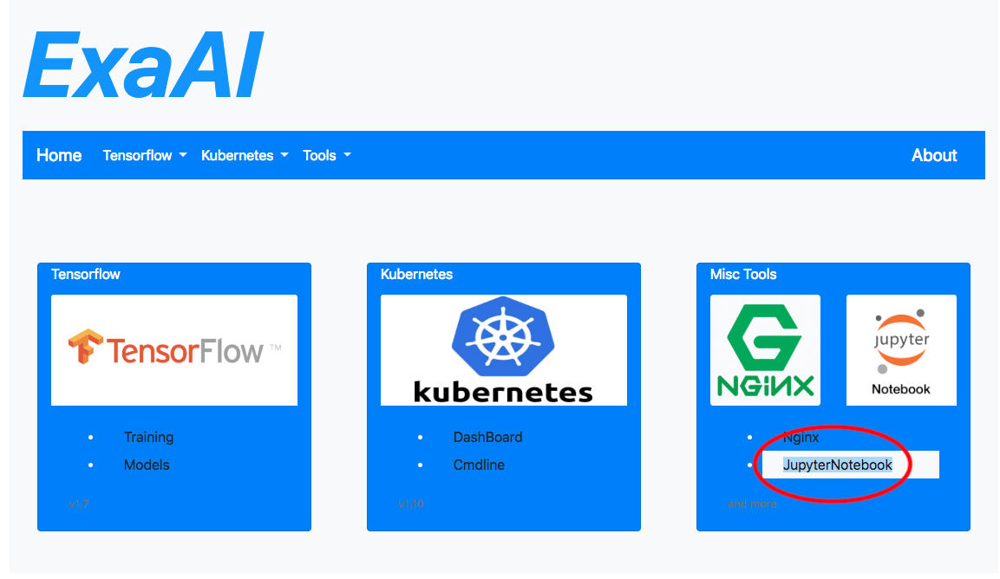
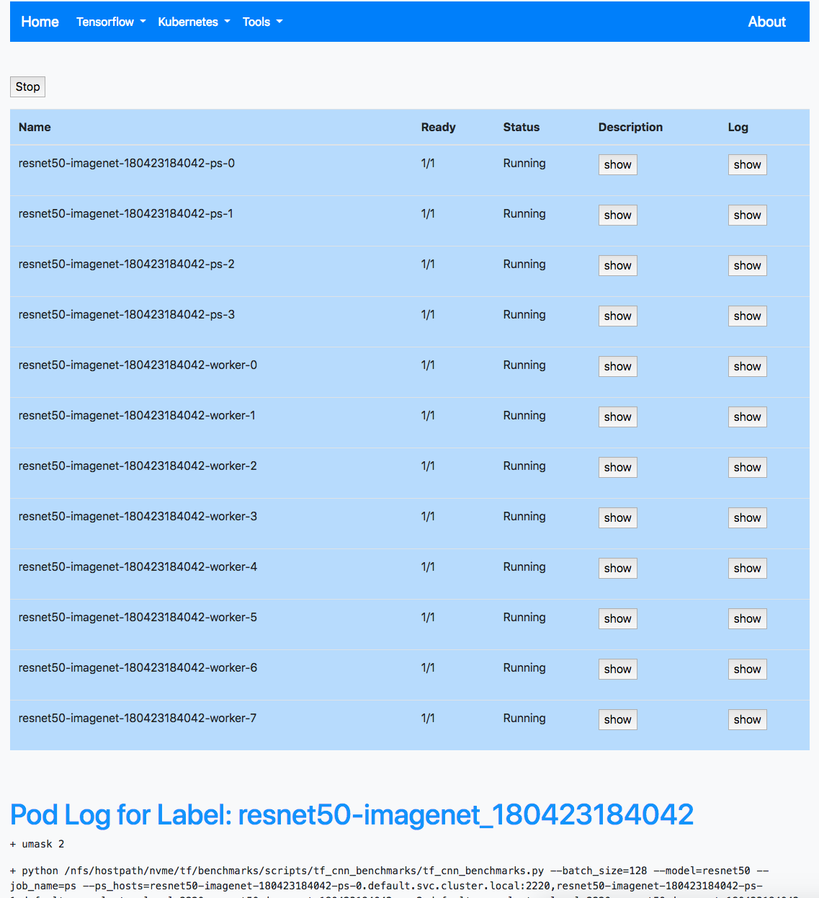
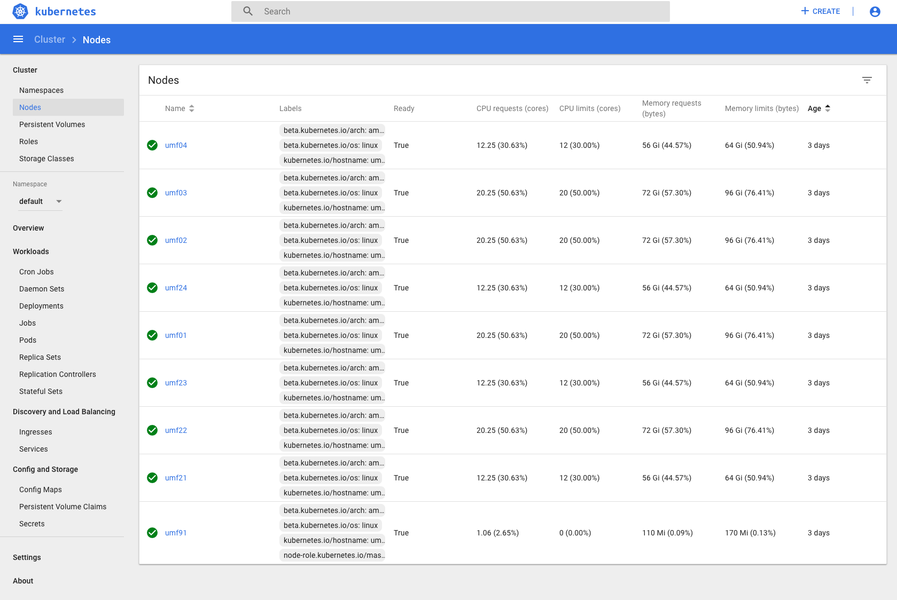
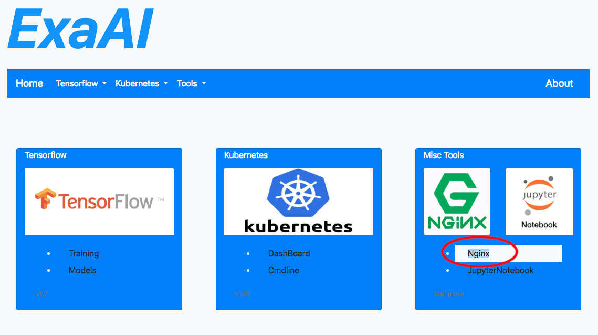

This documents how AI Cloud help the life-cycle of AI development.

# 1.    Getting Started with *JupyterNotebook* 
When to develop new algorithms, people need an interactive development environment to know the effect of each function call, and this is where **JupyterNotebook** shines. AI Cloud provide direct access to **JupterNotebook** with multiple language support(python/R/Julia) and pre-installed packages.

# 2.    Save the working scripts as *Models* 
When the script finally goes through bug free, it is time to save it as a new **model**, and  use it to train massive data. Store the script using Cloud AI’s storage, and tag the newly developed **model** in database for future use.

# 3.	Use the *Training* to start computing. 
Apply the **model** to **train** on massive data, using Cloud AI’s powerful GPU/CPU compute power. People can check tensorflow logs while training in real-time, as well as check Cloud resource usage using **Kubernetes Dashboard** or **cmdline**.

# 4.	Evaluate the training result with *Tensorboard*. 
**Tensorboard** is Google’s answer to help debug the function/performance of the model. Does it converge as expected? How is the data scattered? All information can be learned from tensorboard’s GUI.

# 5.	Store and share results with *nginx*
If everything works fine, people might save the metadata or share with others. **Nginx** as the fastest file server is ready to help. 

